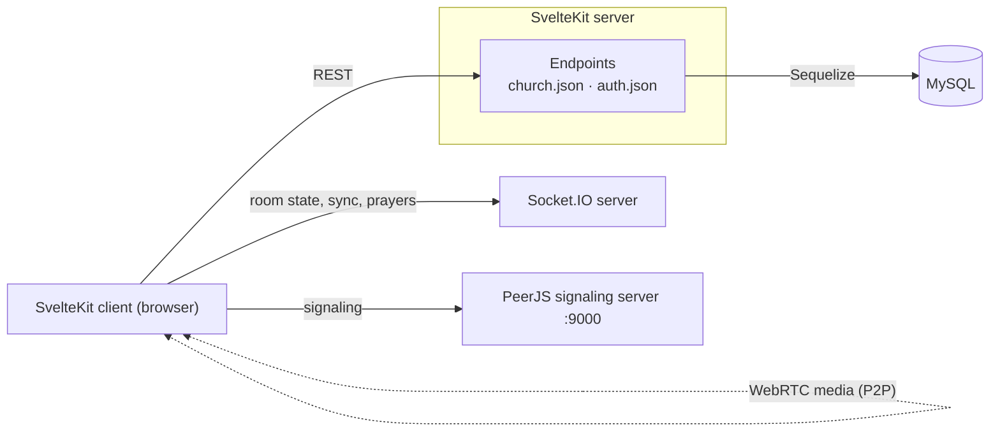

# MyChurch — Virtual Church Platform

A real-time virtual church service app. Congregants pick a church, enter a private room with an access code, sit in virtual "pews", and watch the service together on a YouTube stream synced by the host — with live webcam video of everyone in their seat and a shared prayer-request wall.

> Built in 2021 as a client project. See [Status](#status) for runtime notes.

<!-- Add screenshots here:
| Home | Video room |
| ---- | ---------- |
|  |  |
-->

## Features

- **Church directory** — public, color-coded cards for every church; anyone can browse and join
- **Private rooms** — hosts create rooms with separate admin and participant access codes (hashed with bcrypt before storage)
- **Seat-based video chat** — each room has a configurable number of "pews". Click an open seat, enter your name + access code, and your webcam appears there via WebRTC (PeerJS)
- **Synced YouTube playback** — the host pastes any YouTube link; play/pause/seek events are broadcast so every viewer's player stays in lockstep. Viewers get a control-less player
- **Three view modes** — chair overview (seat availability at a glance), thumbnail wall, or full-screen focus on any seat
- **Prayer requests** — a shared, real-time prayer wall with a slide-in panel
- **Presence** — seats turn red/green as people take or leave them, with disconnect cleanup
- **Mic/cam controls** — toggle your own audio and video at any time

## Tech Stack

| Layer | Choice |
| --- | --- |
| Framework | [SvelteKit](https://kit.svelte.dev) (Svelte 3) + TypeScript |
| Styling | Tailwind CSS |
| Realtime | Socket.IO |
| Video | WebRTC via [PeerJS](https://peerjs.com) (P2P media, signaling server on `:9000`) |
| Data | MySQL via Sequelize ORM, `bcryptjs` for code hashing |
| Deploy | `@sveltejs/adapter-node` + PM2 (`npm start`) |

## Architecture



- **Page data** (`/church.json`, `/video/auth.json`) is served by SvelteKit server endpoints, backed by MySQL.
- **Room state** (seats taken, YouTube sync, prayer requests) flows through Socket.IO events.
- **Video/audio** streams peer-to-peer between browsers; the PeerJS server only brokers connections.

## Getting Started

### Prerequisites

- **Node 16** (this project predates current SvelteKit/Vite releases)
- **MySQL** running locally
- A **Socket.IO server** and a **PeerJS server** on port `:9000` — the client expects both but they are not part of this repo (see [Realtime contract](#realtime-contract))

### Setup

```bash
git clone <repo-url>
npm install

# 1. Create the database (Sequelize auto-syncs the schema on first request)
mysql -u root -p -e "CREATE DATABASE mychurch;"

# 2. Point the app at your MySQL instance — see src/model/_index.ts
#    (defaults: root / 12345678 @ localhost:3306 / database "mychurch")

# 3. Start the companion realtime servers (Socket.IO + PeerJS)

# 4. Run the app
npm run dev
```

Then open the app, add a church at `/church/add` (you'll pick the admin and participant codes), and open `/video/<id>` in two browser windows to see it live.

### Scripts

| Command | Purpose |
| --- | --- |
| `npm run dev` | Dev server with HMR |
| `npm run build` | Production build (Node adapter) |
| `npm start` / `npm stop` | Run the built app under PM2 (port `3001`, see `mychurch.js`) |
| `npm run check` | Type-check with `svelte-check` |
| `npm run lint` / `npm run format` | ESLint + Prettier |

## Realtime Contract

The client is a thin layer over these Socket.IO events — useful if you're reimplementing the companion server:

| Event | Direction | Payload | Purpose |
| --- | --- | --- | --- |
| `guest-room` | c → s / s → c | `roomId` | Join a room / trigger seat-state sync |
| `seats` | c ⇄ s | `Seat[]`, `youtubeId` | Current seat map + active video |
| `join-room` | c → s | `seat`, `name`, `peerId` | Announce yourself after WebRTC is ready |
| `user-connected` | s → c | `seat`, `name`, `peerId` | Connect media to the newcomer |
| `disconnected` | s → c | `seat` | Free a seat |
| `yt` / `link` | c → s / s → c | `videoId` | Host changes the service video |
| `play` / `pause` / `buffer` | c → s / s → c | `timestamp` | Playback sync (seek + play/pause) |
| `prayer` / `prayers` | c ⇄ s | `{ name, message }` | Prayer wall, incl. catch-up for newcomers |

A seat is `{ seat: number, name?: string, userId?: string, taken: boolean }`.

## Status

This repo was written in 2021 against early SvelteKit releases (`1.0.0-next.139`), so it needs Node 16 to run as-is. The Socket.IO and PeerJS companion servers were deployed separately for the client and are not included here — the event contract above documents what they need to speak.

## Author

Built by [Sameer](https://github.com/sameer) as a freelance project.
